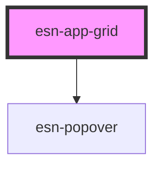

# esn-app-grid

<!-- Auto Generated Below -->

## Properties

| Property          | Attribute          | Description                                                                  | Type     | Default     |
| ----------------- | ------------------ | ---------------------------------------------------------------------------- | -------- | ----------- |
| `serializedItems` | `serialized-items` | A serialized JSON object that contains information about the available apps. | `string` | `undefined` |

## Dependencies

### Depends on

- [esn-popover](../esn-popover)

### Graph

----------------------------------------------

*Built with [StencilJS](https://stenciljs.com/)*
