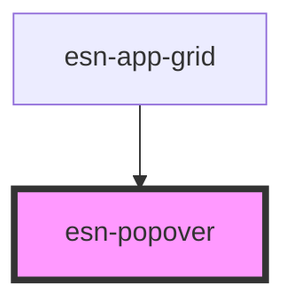

# esn-popover

<!-- Auto Generated Below -->

## Methods

### `toggleShowState() => Promise<void>`

A method to toggle the popover on/off.

#### Returns

Type: `Promise<void>`

## Dependencies

### Used by

 - [esn-app-grid](../esn-app-grid)

### Graph

----------------------------------------------

*Built with [StencilJS](https://stenciljs.com/)*
